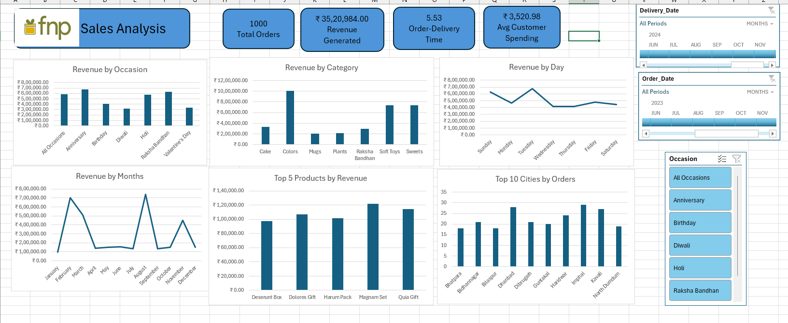

# Ferns-N-Petals-Sales-Analysis
End-to-End Excel Data Analytics &amp; Dashboard Project using Power Query, Power Pivot, and DAX.

# Ferns N Petals (FNP) Sales & Delivery Analytics Dashboard

##  Project Overview
- **Goal:** Analyze multi-table sales and delivery performance for an online gifting platform to uncover revenue drivers, high-demand occasions, and fulfillment bottlenecks.
- **Tools Used:** Microsoft Excel, Power Query, Power Pivot (Data Modeling & DAX), Pivot Tables, Interactive Charts.

## Data Architecture & Workflow
1. **ETL (Power Query):** Cleaned, transformed, and loaded 3 relational datasets (`Orders`, `Customers`, `Products`).
2. **Data Modeling (Power Pivot):** Modeled a star schema connecting transactions with dimension tables without resource-heavy lookup formulas.
3. **Measures & KPIs (DAX):** Built custom measures for Total Revenue, Average Delivery Time, and Order Frequency.
4. **Dashboard:** Interactive dashboard with slicers (Occasion, Date Range, Category) and delivery performance tracking.

##  Key Business Insights
- High-performing festive drivers (e.g., Raksha Bandhan and Diwali) generate peak order volumes and higher average customer spend.
- Delivery turnaround benchmarks highlight key locations requiring logistics route optimization.

## Repository Contents
- `FNP_Sales_Dashboard.xlsx` - Completed Excel workbook and interactive dashboard.
- `Datasets/` - Raw CSV files (`orders.csv`, `customers.csv`, `products.csv`).
